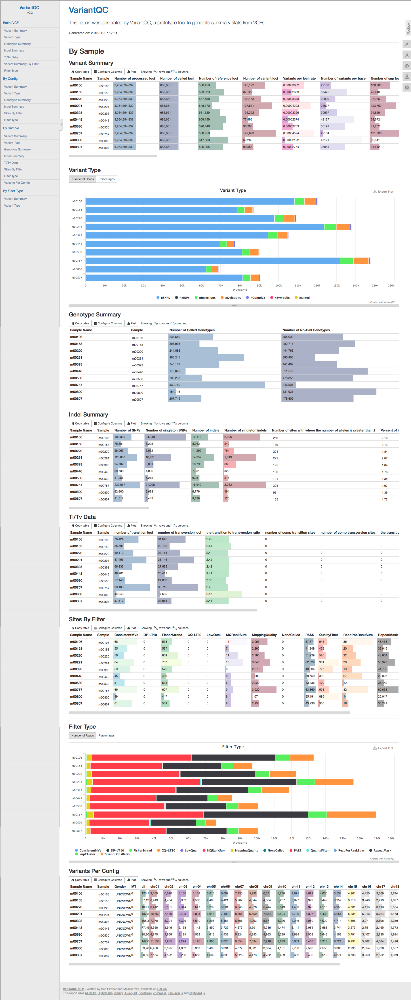

# VariantQC: A Visual QC Report for Variant Evaluation

   
[](https://github.com/bbimber/gatk-protected/releases/tag/0.09)

VariantQC is a standalone Java tool that generates a QC report to summarize millions of variants concisely and highlight potential problems.  This tool utilizes [GATK](https://software.broadinstitute.org/gatk/)'s VariantEval tool for variant evaluation and leverages [MultiQC](http://multiqc.info/)'s HTML QC report.

>High throughput sequencing advancements have accelerated genomic studies of human disease and these large scale sequencing studies typically produce millions of sequence variants.  Because QC evaluation ensures derived genotype data is consistent and accuarte, there is a need for QC reports to summarize millions of variants concisely and to highlight potential problems.  VariantQC address these needs by summarizing variant evaluation results in an interactive visual QC report.

# Getting Started
## Prerequisites
* Java 1.8 ([How to install Java](https://github.com/in28minutes/getting-started-in-5-steps))

## Installing
1. Download the jar file from [here](https://github.com/bbimber/gatk-protected/releases/download/0.09/VariantQC-0.09.jar).
2. Go to the folder containing the jar file
3. Run the VariantQC command

## Parameters
|Argument                  | Default Value | Summary                                | 
| ------------------------ | ------------- | ---------------------------------------| 
| -T, --analysis_type      | NA            | Specify 'VariantQC' tool name 
| -R, --reference_sequence | NA            | Reference genome for VCF's species 
| -ped, --pedigree         | NA            | Pedigree file for VCF samples, only used to get gender information
| -V, --variant            | NA            | VCF to be evaluated and summarized
| -o, --out                | stdout        | Output

## Usage Example
```bash
java -jar VariantQC.jar \
   -T VariantQC \
   -R reference.fasta \
   -ped gatk.ped \
   -V input.vcf \
   -o output.html 
```

## Example VariantQC Report


# Authors
* Benjamin N. Bimber, Ph.D.
* Melissa Yan

# Acknowledgments
This work is supported by NIH grants R24 OD021324 and P51 OD011092. We wish to acknowledge the Broad Institute for permission to use the [GATK](https://software.broadinstitute.org/gatk/) toolkit and Phil Ewels for permission to use [MultiQC](http://multiqc.info/).
